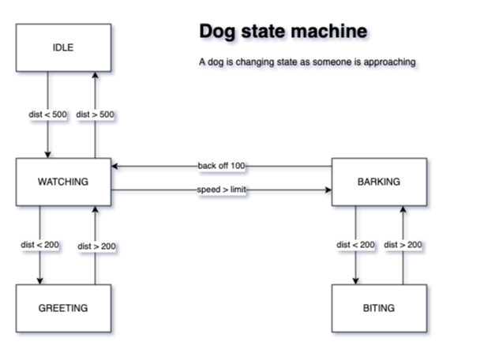

# Dog StateMachine demo for Arduino

Pierre Rossel, 2020-12-03, version 1.0.0

Based on <https://bitbucket.org/pierrerossel/state-machine-arduino-demo>

Using a state machine facilitate the creation of an application that has different tasks to do at different times and separate the code in different state classes.

In this demo, the scenario is a dog watching someone. The doc is attached with a 200 cm leash. Depending on the distance between them and the speed, the dog can be friendly and great the visitor or bark and bite when in range.



This demo contains a StateMachine class and a State base class you can reuse to create your own states for Arduino.

## Try the demo

* Open this project in Arduino
* Connect an arduino
* Upload the sketch and open the Serial monitor at 9600 baud
* Send 4500 and see the dog change its state
* Send 1800 and other distances to make the dog change state
* Have a look at the main loop() function which is really simple
* Have a look at the loop() functions in the State* classes in States.h file.
* There are other distances to experiment, see the code and test them with the serial monitor

## AnalogRead

Sending 0 with the monitor enables the analog mode in
which the program reads an analog value on A0. The default value of the mode variable can also be changed to ANALOG.

The goal is to be able to connect a distance sensor or simulate the distance with a potentiomèter.

Note: The code has not been tested so far in this mode.

## Basic usage for using your own states in your sketch

* Copy the StateMachine.h file in your project
* Create one or more files to contain your states, each state being a class inherited from the base State class. See States.h for examples
* In your own state class, override at lease the loop function and code here what you would do in the main loop() function for that state. Don't forget to return NULL if you don't want to switch to another state.

```CPP
// File States.h

#include "StateMachine.h"

class StateBlink : public State {

    State * loop() {
      digitalWrite(LED_BUILTIN, millis() % 1000 > 500);
      return NULL;
    }

};
```

* Override enter() or exit() if you need to execute someting when the state enters or leaves
* In the main program, include your states file and declare a StateMachine instance

```CPP
#include "States.h"

StateMachine sm;
```

* Create initial state in setup()

```CPP
void setup() {
  sm.changeState(new StateBlink());
}
```

* Call state machine loop() function from your main loop() function

```CPP
void loop() {
  sm.loop();
}

```

## Changing state

There are several ways to change the state.

### Call changeState()

The state machine has a changeState() function that you can call when you want to switch to another state.

From your main loop, check if a condition is met, create a new State and give it to the state machine.

```CPP
// You main programm loop function
void loop() {
  sm.loop();

  if (/* some condition */) {
      sm.changeState(new StateGlow());
  }
}
```

### Return a new state from your state loop() function

When an object is returned from your state loop() function, the state machine switches to this new state.

```CPP
// File States.h

class StateGlow : public State {

    State *loop() {

      // ...

      // Change state after some time.
      // Note: We can only create (new) a new object of a class
      // that has been already declared before this one.
      return getStateTime() > 5000 ? new StateBlink() : NULL;
    }

};
```

#### Known limitation

The new state class must be defined above or you will get a compilation error. So order your state classes accordingly.

If you need to cross reference your states, here are some not tested ways to explore:

* Implement the loop() function after all state classes declaration. (See StateBlink and StateGlow example)
* Split state classes declarations and implementations
* Use some variable declared in main program *before* including your states file(s). They will be visible by all states. Then use the main loop to trigger the state changes based on these values.
